# Directives
 <h2> There are 3 types of Directives </h2>
 - component 
 - structural
 - attribute

 1. component is a type of directive
  - class of its own
  it has its own template
  - every angular app must have atleast 1 directive(component)
  - Please refer to components tutorial to learn in depth

 2. Structural Directive
 - (*) symbol 
 - These directives alter the structure of the template
 - ngFor,ngIf and ngSwitch
 - for loop in ant other language - js,java, this idea is same
   you iterate over a set of dat and do some operations
 - ngIf we can do a conditional expression
    -if else -you would have written in any other language
    - else statement using template variable 
 - ngswitch
    - switch case statements to evaluate some expressions
        - true or false -> corresponding output       
 
 3. Attribute Directives
    There are mainly 2 attribute directives
    ngClass and ngStyle
    

# NgClass
-ngClass is a directive which is used to set the class name for DOM elements
- [ngclass] =""
- common mistake -case sensitive of ngClass
                 - string quotes

- Examples 
        - simple using static class name
        - dynamic - from the component
        - array classes - to pass more than 1 class we use array [clsName,clsName2]
        - ngClass with Expression to true and false
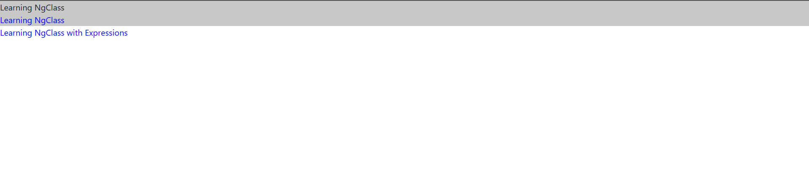
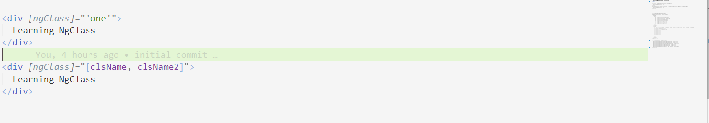
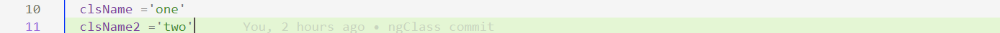

        
# NgStyle
- ngStyle is used for setting the style attributes of DOM elements
- we can set one or more properties
- common mistake = [ngStyle] case sensitivity
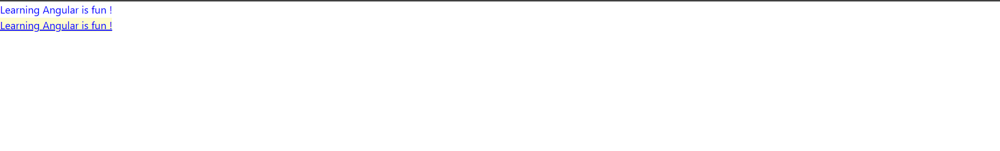
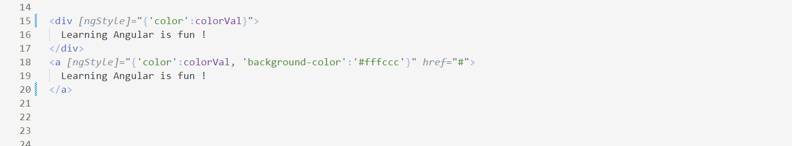
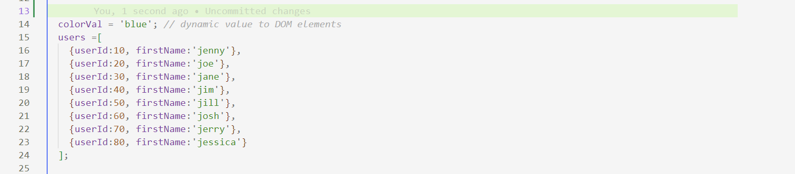

# NgFor
- Similar to For loops that we use in other programming languages
- Don't worry about {{ }} -data binding 
- Provides local Variables in the array data
- Index - gets the current index of the current element in iteration ,its very important whenever DOM manipulation
- First - returns true if the current element is the first element in iteration
- last  - returns true if the current element is the last element in iteration
- Even  - gets the even number
- odd   - gets the odd number in iterations
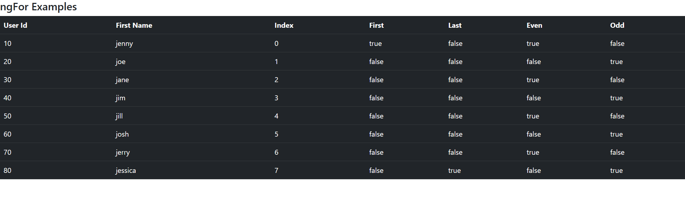
 

# NgSwitch
- ngSwitch
    - build-in directive
    - starts with *ngSwitchCase
    - it is used to compare more than one expression at one time unlike ngIf which usually resolve to true or false/boolean values
    - We can have multiple checks in ngSwitch
    - *ngSwitchCase - Where we will mention about the check condition/expression
    - *ngSwitchDefault - what it should do when no condition is matching 
     can be read the value dynamically
    - Example - we can pass any value - can be integer/string etc.
    - where we make mistakes
    - missing out on *
    - for the string values - put the "'Strings'"
    - when using switch -> [ngSwitch] - look out on the case sensitivity
    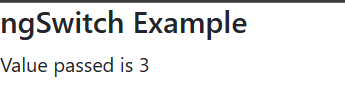
     
    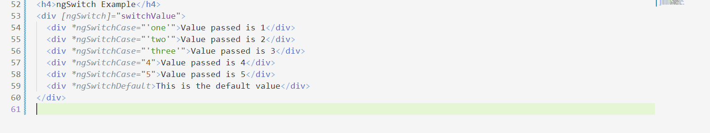
     
    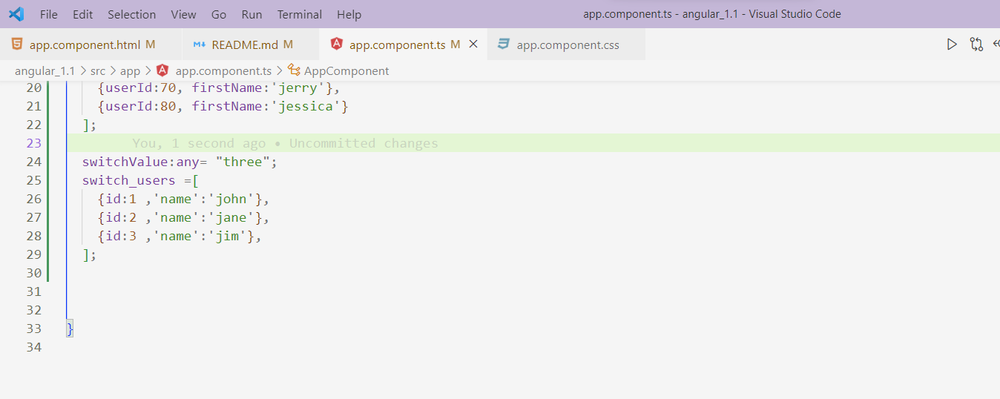

# NgIf - else
- *ngIf -expression check
    - to show or hide the elements
- *ngIf ="expression" else templateVariableName -> #templateVariableName
- whenever we want to use template variable reference - we SHOULD use <ng-template>
- For eg
 
Show Value

 <ng-template #showMessage> Showing else msg </ng-template>
 <ng-template #thenBlock>Showing then msg</ng-template>
    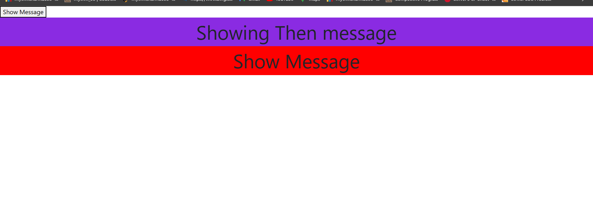
    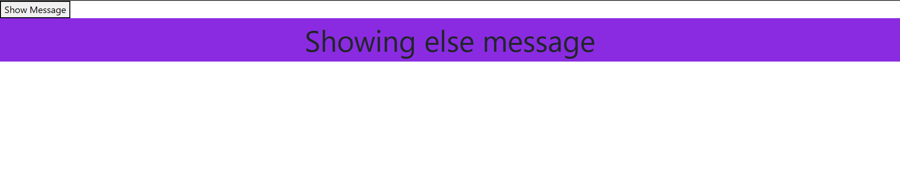
    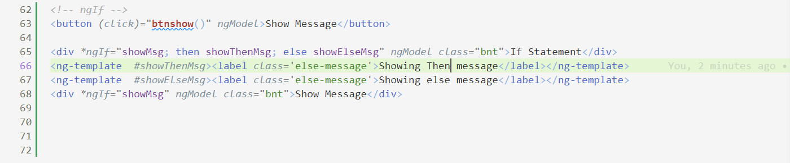
    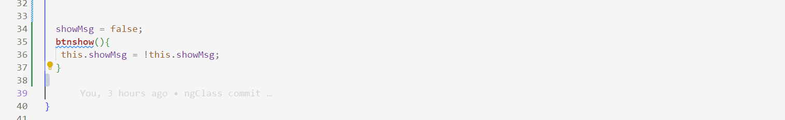

# Attribute Directives
- Change the appearance or behavior of DOM elements and Angular components with attribute directives.
- NgNonBindable
- NgStyle
- @Input()
- @HostListener()
- @HostBinding()
- @Directive()
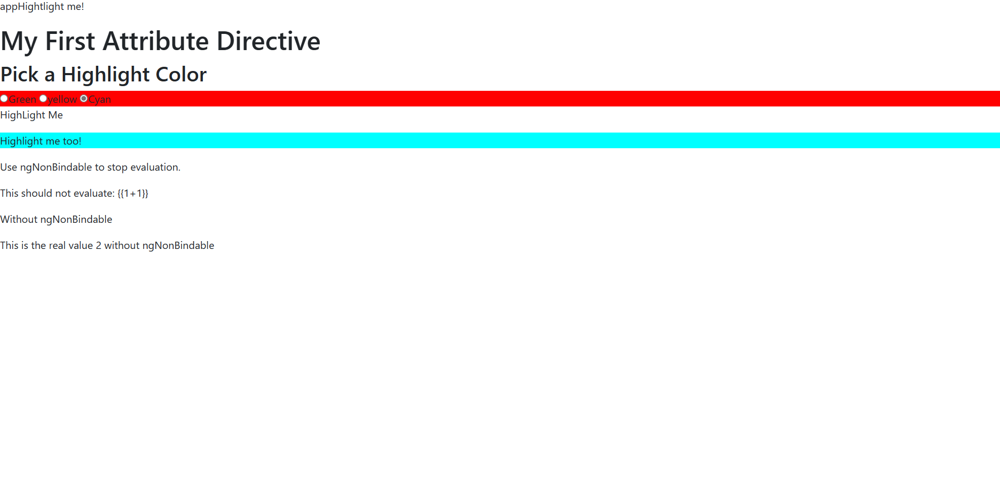
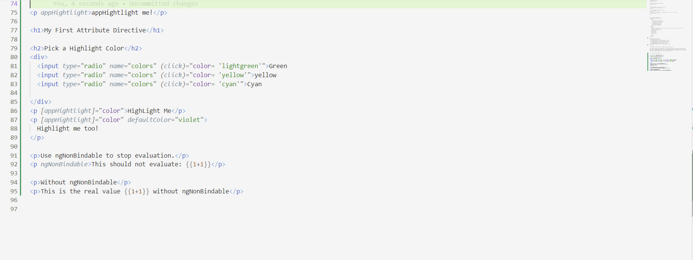

# Pipes
- Pipes are used to transform the data
- <h2>There are build-in pipes</h2>
  - lowercase
  - Percent
  - Currency
  - Date
  - Json
  - Decimal
  - Uppercase
  - Slice
  - Titlecase
  - Async
  - Custom Pipes
  - Pipe Chaining
  - Pipe Parameters
  - Pipe Fallback
  - Pipe Impure
  - Pipe Pure
  - Pipe Memoization
  - Pipe Memoization with TrackBy
  - Pipe Memoization with TrackBy and Async
  - Pipe Memoization with TrackBy and Async and OnPush
  - Pipe Memoization with TrackBy and Async and OnPush and ChangeDetectionStrategy
  - Pipe Memoization with TrackBy and Async and OnPush and ChangeDetectionStrategy and ChangeDetectorRef
  - Pipe Memoization with TrackBy and Async and OnPush and ChangeDetectionStrategy and ChangeDetectorRef and OnChanges
  - Pipe Memoization with TrackBy and Async and OnPush and ChangeDetectionStrategy and ChangeDetectorRef and OnChanges and DoCheck
  - Pipe Memoization with TrackBy and Async and OnPush and ChangeDetectionStrategy and ChangeDetectorRef and OnChanges and DoCheck and AfterContentInit

- <h2>Parameterized Pipe</h2>
- We can pass one or more parameters to pipe
- We pass parameters using the colon(:) symbol
  - Currency
    - Currency Symbol
    - Currency Code
    - Currency Digital variations
  - Date
    - 'short': equivalent to 'M/d/yy, h:mm a' (e.g. 6/15/15, 9:03 AM).
    - 'medium': equivalent to 'MMM d, y, h:mm:ss a' (e.g. Jun 15, 2015, 9:03:01 AM).
    - 'long': equivalent to 'MMMM d, y, h:mm:ss a z' (e.g. June 15, 2015 at 9:03:01 AM GMT+1).
    - 'full': equivalent to 'EEEE, MMMM d, y, h:mm:ss a zzzz' (e.g. Friday, June 15, 2015 at 9:03:01 AM GMT+01:00).
    - 'shortDate': equivalent to 'M/d/yy' (e.g. 6/15/15).
    - 'mediumDate': equivalent to 'MMM d, y' (e.g. Jun 15, 2015).
    - 'longDate': equivalent to 'MMMM d, y' (e.g. June 15, 2015).
    - 'fullDate': equivalent to 'EEEE, MMMM d, y' (e.g. Friday, June 15, 2015).
    - 'shortTime': equivalent to 'h:mm a' (e.g. 9:03 AM).
    - 'mediumTime': equivalent to 'h:mm:ss a' (e.g. 9:03:01 AM).
    - 'longTime': equivalent to 'h:mm:ss a z' (e.g. 9:03:01 AM GMT+1).
    - 'fullTime': equivalent to 'h:mm:ss a zzzz' (e.g. 9:03:01 AM GMT+01:00).

- <h2>Chaining Pipes</h2>
    - Using multiple pipes on a data input is called as Chaining Pipes
    - We can pass one or more pipes to a data input
       - {{dob| date|uppercase}}
       
  

